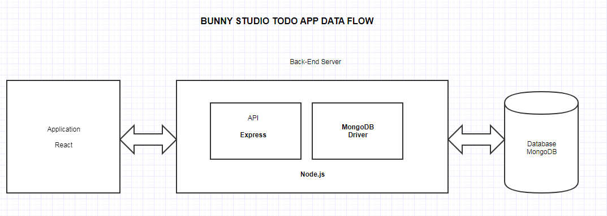

# Bunny Studio - Full Stack Eng. Test

## Technology Used
- Node.js
- Express
- MongoDB
- React
- Redux - For State Management

## How to run the App

You need to have Node.js already installed to run this app

```git clone https://github.com/ClintPy/Todo-FullStack.git```

In the Project Directory:

```cd src```
```npm install```

Wait for the dependencies to install then:

```cd client```
```yarn install```

Wait again for the dependencies to install then:

```cd..```

go back to the ``src\`` folder and:
rename .env-change file to .env then:

```npm run dev```

# App Architecture



Developed Using :
## Node.js 10.16.3

## API Endpoints

| EndPoint                      | Functionality                  |
| --------------------------    | ------------------------------ |
| GET /api/v1/users             | Get all users.                 |
| GET /api/v1/users/<userID>    | Get Specific Users             |
| POST /api/v1/users            | Add new User.                  |
| PUT /api/v1/users/<userID>    | Update user.                   |
| DELETE /api/v1/users/<userID> | Delete user.                   |
| --------------------------    | ------------------------------ |
| POST /api/v1/tasks/<userID>   | Add new tasks                  |
| GET /api/v1/tasks/<userID>    | Get tasks By user              |

## API Server Running at:
https://bunnny-studio.herokuapp.com/

## Front-End Server Running at:
https://inspiring-blackwell-ea3fe9.netlify.com/

